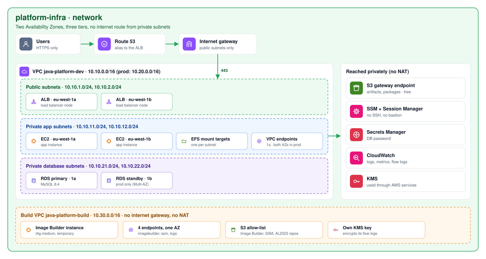

# platform-infra

> Part of **[Java Platform](https://github.com/maga-zargaryan/java-platform)** · [java-app](https://github.com/maga-zargaryan/java-app) (source) · [infra-bootstrap](https://github.com/maga-zargaryan/infra-bootstrap) → **platform-infra** → [java-ami](https://github.com/maga-zargaryan/java-ami) → [java-infra](https://github.com/maga-zargaryan/java-infra)
>
> See [java-platform](https://github.com/maga-zargaryan/java-platform) for how the four layers fit together.

Networking, encryption and certificates for the Java platform: one VPC per
environment (dev, prod) and a private image-build VPC (shared).

```text
terraform/
├── modules/
│   ├── environment/     # dev/prod VPC, endpoints, KMS key, ACM certificate, SSM contract
│   ├── build-network/   # private Image Builder VPC, endpoints, build security group
│   └── kms-key/         # customer-managed key with service-scoped key policy
├── environments/
│   ├── dev/             # state platform/dev,  config terraform.tfvars
│   └── prod/            # state platform/prod, config terraform.tfvars
└── shared/              # state platform/shared, config terraform.tfvars
```

## Diagrams

### Network

<picture>
  <source media="(prefers-color-scheme: dark)" srcset="docs/diagrams/network.dark.svg">
  
</picture>

Three tiers across two Availability Zones, no internet route from private subnets, AWS services reached privately, isolated build VPC.

### Delivery flow

<picture>
  <source media="(prefers-color-scheme: dark)" srcset="docs/diagrams/delivery.dark.svg">
  
</picture>

Pull requests run checks and read-only plans; merging applies dev, then prod after approval using the exact reviewed plan.

Diagram source: [`tools/diagrams`](https://github.com/maga-zargaryan/java-platform/tree/main/tools/diagrams) in the java-platform repository.

## Design

| Concern | Decision |
|---|---|
| Subnets | Public (ALB only, no auto-assigned public IPs), private app, private database (+ DB subnet group) across 2 AZs |
| Egress | **No NAT, no internet route from private subnets.** AWS services through interface endpoints (`ssm`, `ssmmessages`, `secretsmanager`, `logs`, `monitoring`) and the free S3 gateway endpoint |
| Endpoint redundancy | Prod: endpoints in every AZ. Dev and build: one AZ (non-production, reduced cost) |
| Encryption | One customer-managed KMS key per environment (`alias/java-platform-<env>`), rotation on. Key policy allows EBS/RDS/EFS/Secrets Manager/SNS via service, the Auto Scaling service-linked role, CloudWatch Logs and CloudWatch alarms |
| Visibility | VPC flow logs (all traffic, 60s) to KMS-encrypted CloudWatch Logs; 30 days dev/build, 365 days prod |
| Hardening | Default security group stripped of all rules; the build VPC's S3 endpoint only allows the AWS buckets builds need, plus the artifacts bucket (the release JAR is baked into the app AMI) |
| TLS | ACM certificate per environment, DNS-validated in the hosted zone owned by infra-bootstrap |

## Contract (SSM Parameter Store)

| Path | Consumer |
|---|---|
| `/java-platform/<env>/{vpc_id, vpc_cidr, public_subnet_ids, app_subnet_ids, db_subnet_group_name, endpoint_sg_id, s3_prefix_list_id, kms_key_arn, acm_certificate_arn, domain_name, route53_zone_id}` | java-infra |
| `/java-platform/shared/{vpc_id, build_subnet_id, build_security_group_id}` | java-ami |

## Delivery

| Workflow | Trigger | What it does |
|---|---|---|
| `pr.yml` | Pull request | fmt, validate, tflint, Trivy; plan for shared/dev/prod with **read-only** roles (skipped when nothing under `terraform/` changed); `ci` is the required check |
| `deploy.yml` | Merge to `main` | apply shared → apply dev → plan prod (stored in the private plan bucket) → **approval** (`production`) → apply that exact plan, then delete it |
| `destroy.yml` | Manual | destroy one stack (type its name to confirm). Destroy java-infra first; destroy java-ami before shared |

Production stages (prod plan on pull requests, prod plan/apply on deploy) run only when the
repository variable `PRODUCTION_ENABLED` is `true`; it is managed by infra-bootstrap (`production_enabled`).

GitHub Environments, their `AWS_ROLE_ARN`/`AWS_REGION` variables and branch
protection are managed by infra-bootstrap. All other configuration lives in the
committed `terraform.tfvars` files, so every change is reviewed in a pull request.
